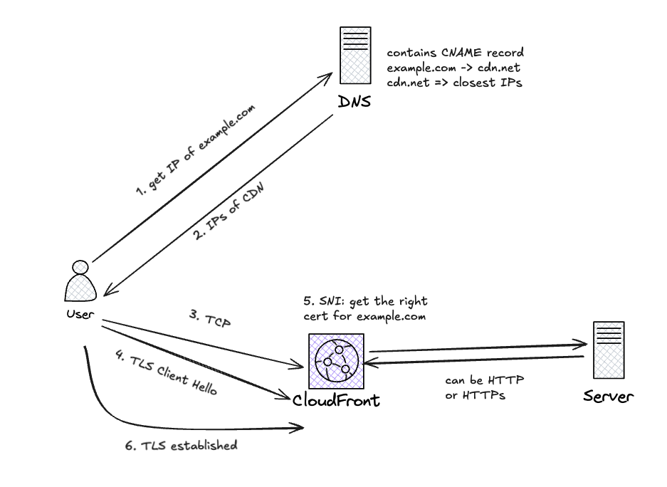

---
date:
  created: 2023-12-31
  updated: 2024-01-02
readtime: 15
pin: true
links:
  - Homepage: index.md#project-layout
  - Blog index: blog/index.md
  - External links:
    - Material documentation: https://squidfunk.github.io/mkdocs-material
categories:
  - Technical
tags:
  - new year
  - hogmanay
  - festive season
authors:
  - team

---

# 🔐 TLS Termination Over CDN / Proxy / Load Balancer

## 🧭 Problem Statement

You have a public-facing domain (e.g., `example.com`) and want to enable HTTPS. Instead of connecting users directly to your backend servers, you place a **CDN**, **reverse proxy**, or **load balancer (LB)** in front of your origin infrastructure.

This raises important architectural questions:

> Where is the TLS connection terminated?
What does the client see and verify?
How is traffic secured between the client, proxy, and origin?
> 

This article clarifies the mechanics and trust boundaries when TLS is used with CDNs, proxies, or load balancers.

<!-- more -->

---

## 🖼️ Diagram of how things work



## Setup

- DNS is configured so that:
    
    ```
    example.com → cdn.example.net (CNAME or A record)
    ```
    
- The CDN provider is issued an HTTPS certificate for `example.com`, and it is **imported at the CDN edge**.
    
    <aside>
    💡
    
    Here raises a question:
    
    The imported cert only has the public key, then how the TLS handshake successfully happened?
    
    Answer: actually the CDN is loaded with the private key of the cert too.
    
    </aside>
    
- The origin server is configured to receive traffic either via:
    - Plain HTTP
    - HTTPS (with its own certificate)

## Flow

Step-by-step process:

1. **Client requests `https://example.com`**:
    - Browser resolves `example.com` to the CDN IP.
    - Client opens a **TCP connection to the CDN**.
2. **TLS Handshake begins**:
    - Client includes `example.com` in the **SNI (Server Name Indication)** field (sent in the Client Hello)
    - CDN uses the SNI to **select the right certificate** for `example.com`.
    - CDN responds with the matching certificate (issued by a trusted CA).
3. **TLS session established**:
    - The client verifies the certificate.
    - A secure channel is now established between the client and the CDN.
4. **CDN forwards the HTTP request** to the origin:
    - Over HTTP or HTTPS (depending on your config).
    - Origin sees the `Host: example.com` header and serves the correct content.

---

## 🔗 TLS Termination Explained

In a typical CDN/LB setup, TLS can be **terminated at the edge**, at the **origin**, or both. These options affect how secure and transparent the connection is.

### ✅ Client → CDN (Public TLS Termination)

- The client opens a TLS session to the CDN or proxy.
- The server presents a certificate **for `example.com`** u sing SNI in the Client Hello
- The client verifies the certificate and encrypts traffic.

🧠 This is the only TLS session the client is aware of. The certificate must match the requested hostname.

---

### 🔁 CDN → Origin (Internal Communication)

After terminating TLS, the CDN forwards the request to the backend origin server. This **internal hop** can be:

- 🔓 **Plain HTTP**
    - No encryption between CDN and origin
    - Simpler, faster — but data is in cleartext over the internal network
- 🔒 **HTTPS**
    - A second TLS session is established between CDN and origin
    - Increases security (useful in multi-tenant or untrusted networks)

---

## 🧠 What the Client Sees (and Doesn’t See)

| Aspect | Client Sees? | Explanation |
| --- | --- | --- |
| TLS cert for `example.com` | ✅ Yes | Presented by CDN or proxy during handshake |
| Origin server’s cert | ❌ No | Not exposed unless client connects directly |
| Whether origin uses HTTPS | ❌ No | Client is unaware of internal hop details |

---

## 🔐 Trust Boundaries

| Segment | Who Trusts Whom | TLS Required? |
| --- | --- | --- |
| Client → CDN | Client trusts CDN’s cert for domain | ✅ Always |
| CDN → Origin | CDN may validate origin cert | ✅ Optional |

If end-to-end TLS is important (e.g., compliance, internal policy), you must enforce HTTPS from the CDN to origin and ensure the CDN **trusts** the origin’s certificate.